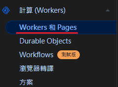
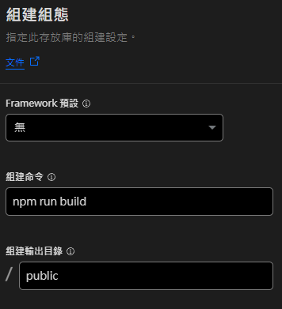
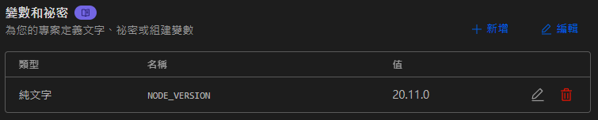

# docs
⭐️ Sam 的文章分享(持續累積中🏃‍♂️)(Hexo版)

使用 Hexo 架設簡單的分享技術文件並發佈到"cloudflare"，包含介紹文章: "全面瞭解 n8n v1.88.0 的重磅更新 —— MCP Server"、"教會你用 Google AI Studio 提早結束工作回家"、"C# 設計模式學習筆記與程式碼範例"、"JavaScript 設計模式學習筆記與程式碼範例"、"Functional Design Pattern 是一個結合函數式程式設計和設計模式的概念"

# Ｈexo
[Hexo 介紹](./docs/Hexo.md)  


# 發佈到 cloudflare
去註冊一個 cloudflare 帳號  
選取左邊選單 "計算(Workers)" 中  
建立 "Worker 和 Pages"  


## 組建組態


### 變數與秘密

```
NODE_VERSION 20.11.0
```
發佈網址: https://docs-axs.pages.dev

### 新增文章目錄
```bash
.\source\_posts\*.md
```

