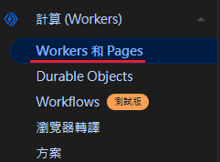
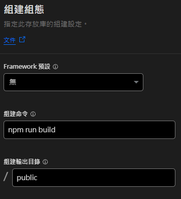

# 📚 docs
⭐️ Sam 的文章分享 (持續累積中 🏃‍♂️💨) (Hexo版)

使用 **Hexo** 🚀 架設簡單的分享技術文件並發佈到 **Cloudflare** ☁️，包含介紹文章：
- 🤖 「全面瞭解 n8n v1.88.0 的重磅更新 —— MCP Server」
- 🧠 「教會你用 Google AI Studio 提早結束工作回家」
- 💻 「C# 設計模式學習筆記與程式碼範例」
- 📜 「JavaScript 設計模式學習筆記與程式碼範例」
- ⚙️ 「Functional Design Pattern 是一個結合函數式程式設計和設計模式的概念」

# 🚀 Hexo
📖 [Hexo 介紹](./docs/Hexo.md)  


# 🌐 發佈到 Cloudflare
1. 註冊一個 [Cloudflare](https://www.cloudflare.com/) 帳號 👤
2. 選取左邊選單 「**計算 (Workers)**」 中 ⚙️
3. 建立 「**Worker 和 Pages**」 📄


## 🛠️ 組建組態


### 🔐 變數與秘密

```
NODE_VERSION 20.11.0
```
🔗 發佈網址: [https://docs-axs.pages.dev](https://docs-axs.pages.dev)

### 📝 新增文章目錄
```bash
.\source\_posts\*.md
```
