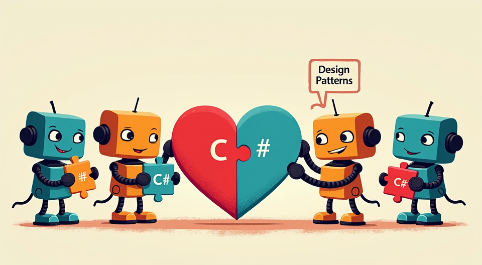

## DesignPatterns.cs

C# 設計模式學習筆記與程式碼範例。

<!-- more -->

# 設計模式設計原則
## 單一職責原則 Single Responsibility Principle (SRP)
對於一個類別，只有一個引起變化的原因。
## 開放封閉原則 Open-Closed Principle (OCP)
對於擴充開放，對於修改封閉。
- 擴充是指不修改原有程式碼，只需添加新的程式碼，就能新增功能。
- 擴充通常指的是繼承、實現接口(interface)或多型(polymorphism)。

## 依賴反轉原則 Dependency Inversion Principle (DIP)
實作要依賴抽象，不要依賴具體類別。
- 抽象類別(abstract class)、接口(interface)、多型(polymorphism)是依賴反轉的三種方式。
- 依賴反轉的好處是降低耦合度，提高程式的可擴充性和可維護性。

## 里式替換原則 Liskov Substitution Principle (LSP)
子類別必須能替換父類別，且不影響原有程式的功能。

## 接口隔離原則 Interface Segregation Principle (ISP)
不依賴不使用的方法
使用接口如果有不使用的方法，應該要拆分出新的接口。

## 迪米特法則 Law of Demeter (LoD)
又稱為最少知識原則（Principle of Least Knowledge），
勵對象之間的松耦合關係。

例如：
系統中有三個類:
A、B和C。如果A的方法需要使用到C的功能，但A只能通過B來獲取C
A不應該直接調用C的方法。
由B去調用C的方法。
A只需要知道B提供的接口，而不需要知道C的存在，從而減少了系統的耦合度。

---

# 創建型模式(Create)
設計模式 SimpleFactory、AbstractFactory、FactoryMethod 的差異為何?  
這三種設計模式都是用來創建對象的工廠模式，但它們在結構和用途上有所不同：  

1. **Simple Factory (簡單工廠模式)**：  
- ⭐ 1️⃣ 簡單工廠(SimpleFactory)  
結構：由一個工廠類負責創建所有的產品對象。  
用途：當創建的對象較少且不需要擴展時使用。  
優點：簡單易用，適合小型應用。  
缺點：違反開放封閉原則，新增產品需要修改工廠類。  

2. **Factory Method (工廠方法模式)**：  
- ⭐ 2️⃣ 工廠方法(FactoryMethod)  
結構：定義一個創建對象的接口，讓子類決定實例化哪一個類。  
工廠方法將實例化操作延遲到子類。  
用途：當創建的對象需要較多的變化且需要擴展時使用。  
優點：符合開放封閉原則，新增產品不需要修改現有代碼。  
缺點：增加了系統的複雜性，需要更多的類來管理。  

3. **Abstract Factory (抽象工廠模式)**：  
- ⭐ 3️⃣ 抽象工廠(AbstractFactory)  
結構：提供一個創建一系列相關或相互依賴對象的接口，而無需指定它們具體的類。  
用途：當需要創建一組相關或依賴的對象時使用。  
優點：符合開放封閉原則，易於擴展，能夠創建一組相關的對象。  
缺點：增加了系統的複雜性，需要更多的類來管理。  

---

這些模式的選擇取決於具體的需求和應用場景。

---

4️⃣ 創建者模型(Builder)  
- Builder 可以讓你更靈活地構建複雜物件，並且可以很容易地擴展和修改構建過程。  

5️⃣ 原型模型(Prototype)  
- Prototype 模式允許你創建對象的複製，而不是通過直接實例化類來創建新對象。這在需要大量相似對象的情況下特別有用。  

6️⃣ 單例模型(Singleton)  

# 結構型模式(Structure)

1️⃣ 適配器模式(Adapter)  
- 使用 Adapter 設計模式將一個類別的介面轉換為客戶端期望的另一個介面。  

2️⃣ 橋接模式(Bridge)  
- 它將抽象部分與實現部分分離，使它們可以獨立變化。這樣可以更靈活地擴展和維護代碼。  

3️⃣ 組合模式(Composite)  
- Composite 設計模式允許你將物件組合成樹狀結構來表示「部分-整體」的層次結構。這個模式讓客戶端可以統一地處理單個物件和物件的組合。  

4️⃣ 裝飾(者/器)模式(Decorator)  

- 可以動態地給對象添加新的功能。  

5️⃣ 外觀/門面模式(Facade)  
- 的是提供一個簡單的介面來訪問複雜子系統中的多個類別。這樣可以讓客戶端程式碼更容易使用和理解。  

6️⃣ 享元模式(Flyweight)  
- 減少物件的數量，從而節省記憶體。  

7️⃣ 代理模式(Proxy)  
- 可以在請求前後執行一些操作。  

---

# 行為型模式(Behavior)

1️⃣ 觀察者模式(Observer)  
- 允許一個對象（Subject）在其狀態改變時通知多個觀察者（Observers）。  

2️⃣ 模板方法(TemplateMethod)  
- 定義了一個操作中的算法骨架，將一些步驟延遲到子類中。這樣，子類可以在不改變算法結構的情況下重新定義算法中的某些步驟。  

3️⃣ 命令模式(Command)  

- 將命令的發送者和接收者解耦。這樣的設計使得命令可以被記錄、排隊、撤銷和重做。  

4️⃣ 狀態模式(State)  
- 管理物件的狀態轉換。IState 介面定義了狀態的行為，OnState 和 OffState 類別實現了具體的狀態行為。  
StateContext 類別負責維護當前狀態並在狀態之間切換。  

5️⃣ 責任鏈模式(Chain of Responsibility)  
- 處理一系列請求。每個具體處理者都會檢查請求是否在其處理範圍內，如果是，則處理請求；否則，將請求傳遞給下一個處理者。  

6️⃣ 解釋器模式(Interpreter)  
- 使用 Interpreter 模式來解析和計算簡單的數學表達式。  

7️⃣ 中介者模式(Mediator)  
- 使用 Mediator 來管理不同對象之間的通信。  
這樣可以避免組件之間的直接依賴，從而提高系統的可維護性和可擴展性。 

8️⃣ 訪問者模式(Visitor)  
- 分離算法與對象結構，使得你可以在不改變對象結構的情況下新增新的操作。  
可以輕鬆地新增新的訪問者，而不需要改變元素的結構。  

9️⃣ 備忘錄模式(Memento)  
- 用於保存和恢復對象的狀態，這在需要撤銷操作的應用程序中非常有用。  

🔟 迭代器模式(Iterator)  
- 使用迭代器來遍歷一個自定義集合。  

1️⃣1️⃣策略模式(Strategy)  

- 設計使得我們可以輕鬆地擴展新的算法，而不需要修改現有的代碼。  

---

### 我的 Github 專案

[🔗 我的 Github 專案: DesignPatterns.cs](https://github.com/chiisen/DesignPatterns.cs)  
C# 設計模式學習筆記與程式碼範例。

---
