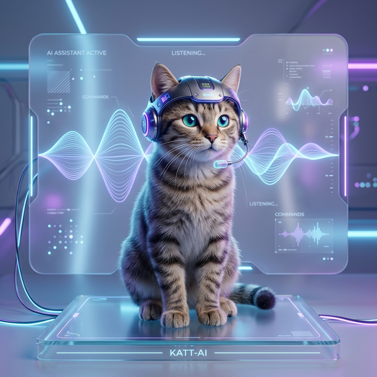

## 語音助理 (Voice-activated Assistant) 🎙️🤖✨

**✅ 一款基於 .NET 10 與 Whisper 技術打造的輕量化語音助理。**

這是一款專為 Windows 環境開發的語音助手，結合了 OpenAI 的 Whisper 語音識別技術與 C# 的強大效能。它不僅具備高精度的即時語音轉文字能力，更透過深度優化實現了零硬碟佔用的純記憶體運作，並支援高度自定義的關鍵字自動回覆功能。

<!-- more -->

# 🚀 快速啟動
1. **環境準備**：確保已安裝 .NET 10 SDK。
2. **啟動程式**：在專案根目錄執行 `dotnet run`。
3. **模型選擇**：
    - **Tiny/Base/Small/Medium**：官方模型，首次啟動將自動下載。
    - **Tiny-zh-TW**：繁體中文微調模型，提供更精準的在地化辨識。
4. **互動方式**：程式啟動後自動監控麥克風，說完話後靜音 1.5 秒即自動中斷並轉錄。辨識到關鍵字後，助理會立即透過 TTS 進行回覆。

# 🛠️ 核心優化
- 💾 **完全記憶體運作 (Zero-Disk Usage)**：移除傳統實體檔寫入，音訊數據直接在記憶體處理，兼具效能與隱私。
- 🎙️ **進階語音偵測 (Adaptive VAD)**：動態底噪追蹤與 600ms Pre-roll Buffer，確保即使是短促的起手字（如「嗨」）也能完整補捉。
- ⚙️ **平行運算加速**：針對 .NET 10 多執行緒優化，自動發揮 CPU 最大算力，實現近乎即時的推論體驗。
- 🔇 **實時語音避讓 (Active TTS Avoidance)**：智慧監測 TTS 狀態，徹底杜絕助理「自言自語」與音訊回授干擾。
- 🧩 **關鍵字回應引擎**：支援透過 `keyword_responses.json` 自定義互動內容，免編譯即可教導助理新技能。
- 🧠 **幻覺抑制**：鎖定 Temperature 0.0 並結合三重過濾機制，確保在安靜環境下不會出現無中生有的文字。

# 🏗️ 技術架構
- **Core**: C# / .NET 10 (net10.0-windows)
- **Speech-to-Text**: Whisper.net (OpenAI Whisper)
- **Audio I/O**: NAudio (WASAPI / WinMM API)
- **Text-to-Speech**: System.Speech (Windows SAPI Engine)
- **Architecture**: 非同步流水線 (Producer-Consumer Pattern)

# 📋 平台限制
由於深度整合了 Windows 原生組件（WASAPI 與 SAPI），目前本專案**僅支援 Windows 作業系統**。

### 我的 Github 專案

[🔗 我的 Github 專案: Voice-activated_assistant](https://github.com/chiisen/Voice-activated_assistant)  
✅ 支援多種 Whisper 模型。歡迎 Star 🌟 或提出功能建議！

---
