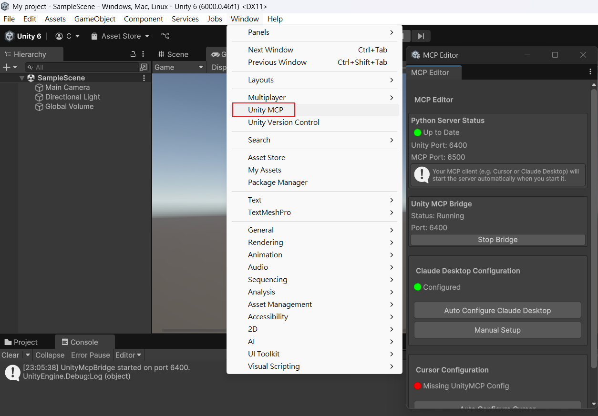
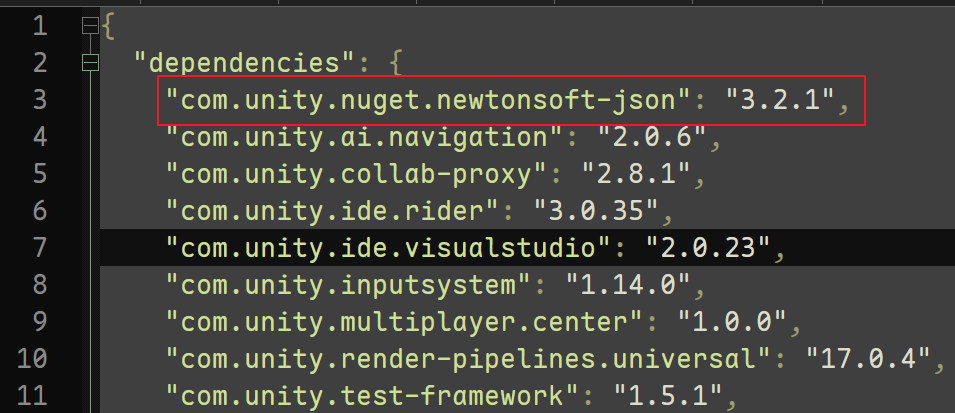
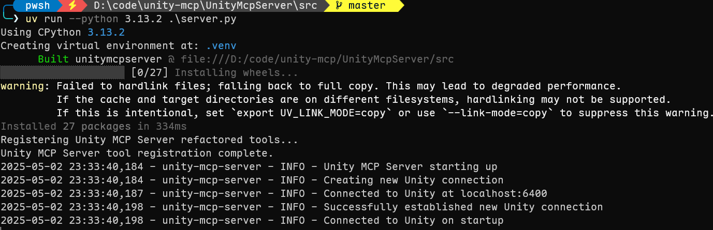
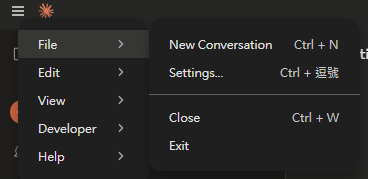
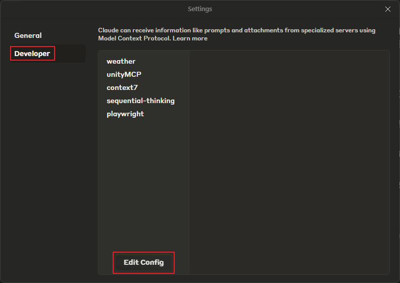
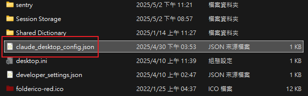

## 利用 Claude 的 MCP 功能，指定 Unity 3D 進行操作

本網頁主要介绍了如何使用 Claude Desktop 的 MCP 功能来操作 Unity 3D，以及如何安装和配置 UnityMcpBridge 和 UnityMcpServer。

## 操作步驟
- 在 Unity 3D 新專案中，安裝 Editor (UnityMcpBridge)  
- 啟動 Python 的 MCP Server (UnityMcpServer)  
- 設定 Claude 的 MCP 服務設定  
## 開源來源
https://github.com/justinpbarnett/unity-mcp/tree/master

## Demo 影片


## 功能
- 場景控制: 查看當前場景, 並且生成物件, Component
- 材質修改: 修改 Material 的顏色和其他 Properties
- 代碼生成: 查看，創建，自動添加代碼到場景上
- 編輯器控制: 可以 Undo、Redo、播放遊戲、Build版本

## 為 Unity 專案安裝 UnityMcpBridge
把 `unity-mcp\UnityMcpBridge\*.*` 複製到 Unity 新專案的 `Assets` 目錄底下  
❗❗❗如果你的專案還沒安裝過 `Newtonsoft Json` 會報錯  
請在 `Packages/manifest.json` 新增 `"com.unity.nuget.newtonsoft-json": "3.2.1"`  

成功後會出現一個 `Unity MCP` 選單

綠燈就是設定完成  
⭐ 本專案已設定完畢，不會設定可以參考本專案 UnityMcpBridge 設定(⭐版權引用自 justinpbarnett)

## 啟動 Python 的 MCP Serve (UnityMcpServer)
安裝 uv (Python 套件) https://docs.astral.sh/uv/getting-started/installation/?ref=unityflow.dev#__tabbed_1_2
```shell
powershell -ExecutionPolicy ByPass -c "irm https://astral.sh/uv/install.ps1 | iex"
```
可以在 PowerShell 7 中安裝 uv  
```
uv python list
```
可以知道 uv 安裝那些 Python 版本  
```
uv python install 3.10
```
可以安裝 Python 3.10 版本  
```
uv python uninstall 3.10
```
可以移除 Python 3.10 版本  

在 `unity-mcp\UnityMcpServer\src` 目錄下執行 Python 程式  
```
uv run --python 3.10 .\server.py
```
可以指定 Python 版本執行程式  


## 設定 Claude Desktop 的 MCP 設定
點選 `File` => `Settings`  

點選 `Developer` => `Edit Config`  

會開啟目錄，請打開 `claude_desktop_config.json`  
新增下面設定  

```json
{
  "mcpServers": {
    "unityMCP": {
        "command": "uv",
        "args": [
            "--directory",
            "C:\\Users\\chiis\\AppData\\Local\\Programs\\UnityMCP\\UnityMcpServer\\src",
            "run",
            "server.py"
        ]
    }
  }
}
```

## 操作 Demo
在 Claude Desktop 中輸入 `create a cube` Unity 3D 新專案就會升成一個 Cube 在編輯器中  
⭐ 本專案已設定完畢，不會設定可以參考本專案 UnityMcpServer 設定(⭐版權引用自 justinpbarnett)

---

[🔗 我的 Github 範例專案: 【unity-mcp】](https://github.com/chiisen/unity-mcp)  
利用 Claude 的 MCP 功能，指定 Unity 3D 進行操作[C#](https://img.shields.io/badge/c%23-%23239120.svg?style=for-the-badge&logo=csharp&logoColor=white)   

---
