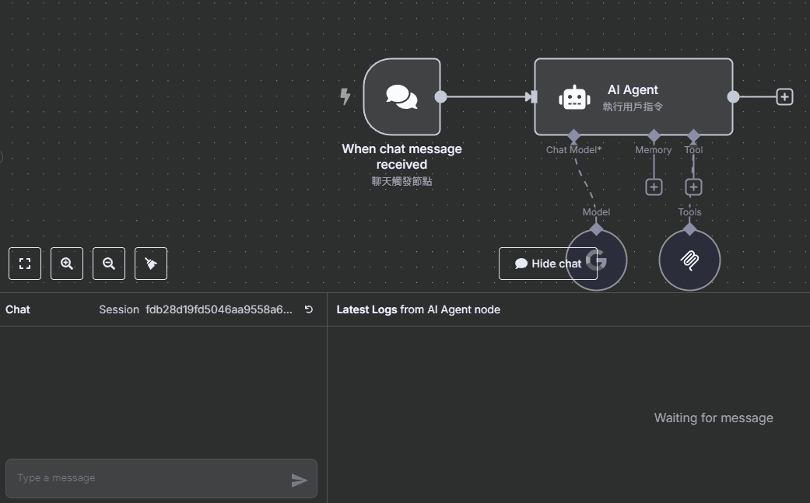

## 全面瞭解 n8n v1.88.0 的重磅更新 —— MCP Server

在 n8n 1.88.0 版本中，允許使用 SSE（Server-Sent Events）技術進行發佈的功能主要與新加入的 MCP（Model Context Protocol）節點相關。

<!-- more -->

### 我的 Github 專案

[🔗 我的 Github 專案: 【n8n】](https://github.com/chiisen/n8n)  
全面瞭解 n8n v1.88.0 的重磅更新 —— MCP Server

---
