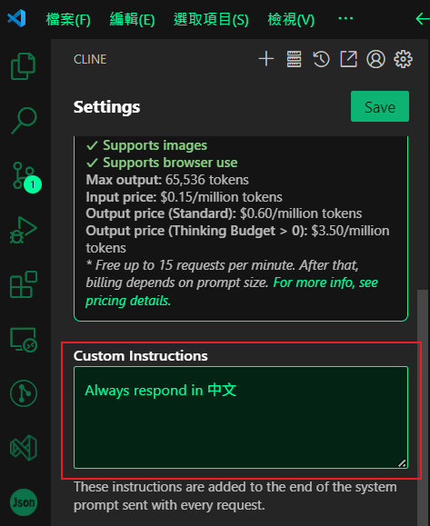

# CLine (.clinerules)
  

CLine 透過 .clinerules 自定義指令，並附上多個範例文件。  

<!-- more -->

## Custom Instructions(自訂義指令)
如上截圖所示，範例如下:  
```md!
Always write comments in Chinese for each function
Where writing JavaScript, prefer function programming paradigms over object-oriented approaches where appropriate
```
翻譯成中文:
```md!
務必為每個函數寫上中文註釋
在編寫 JavaScript 時，在適當的情況下優先使用函數程式設計範式而不是物件導向的方法
```

## .clinerules 範例
目錄下的個別專案 CLine 所使用的 Rules 設定(.clinerules 是一個檔案名時)
```markdown

## 文檔搜索

在需要查詢 Next.js 和 Tailwind CSS 相關文檔時，務必使用 Context7 以獲取最新的、版本相關的文檔信息。

### Next.js 文檔搜索

當需要查詢 Next.js 文檔時，**搜索 Next.js 的穩定版本文檔**。在你的提問中，明確包含 `use context7` 並指明需要 Next.js 的穩定版文檔。例如：

use context7 搜索 Next.js 穩定版關於路由功能的文檔

### Tailwind CSS 文檔搜索

當需要查詢 Tailwind CSS 文檔時，**搜索 Tailwind CSS 的最新版本文檔**。在你的提問中，明確包含 `use context7` 並指明需要 Tailwind CSS 的最新文檔。例如：

use context7 搜索 Tailwind CSS 最新版關於響應式設計的文檔
```

## .clinerules Folder
目錄下的個別專案 CLine 所使用的 Rules 設定  
(.clinerules 是一個目錄名時，目錄裡面允許多個設定檔案)  

可以參考下面我的 GitHub 筆記 https://github.com/chiisen/CLine  
