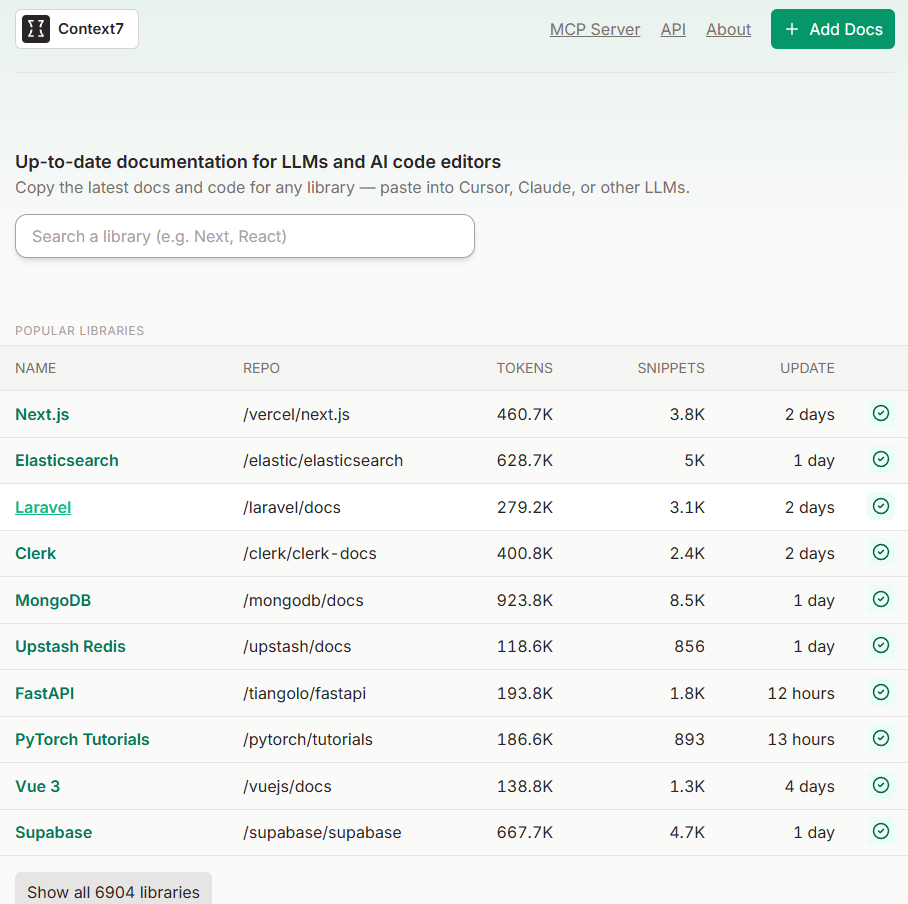

# Context7 (MCP Server)


Context7 是一個為你的 AI 編程助手量身打造的最新文檔資料庫，並能細緻區分不同版本。

<!-- more -->

他們整理並結構化了超過 3500 套市面上的主流開源庫官方文檔，等於把整個技術圈的“知識寶庫”打包好了，變成一個專門搜尋技術文檔的 RAG 系統。

簡單來說，就是你問問題，它就能即時從這些文檔中撈出最相關的片段回應你，還能自訂返回內容的長度（token 數），靈活又精準。

這就像一座專屬於 AI 編程的強大 MCP 伺服器，讓你的開發力大幅升級。

特別是在 AI 編碼的痛點之一：知識庫更新不及時——Context7 剛好解決了這個問題。

#  Claude Desktop 安裝
將此內容添加到你的Claude Desktop `claude_desktop_config.json` 文件中。
```json
{
  "mcpServers": {
    "Context7": {
      "command": "npx",
      "args": ["-y", "@upstash/context7-mcp@latest"]
    }
  }
}
```

# 官網
https://context7.com/

https://github.com/upstash/context7/blob/master/docs/README.zh-CN.md
