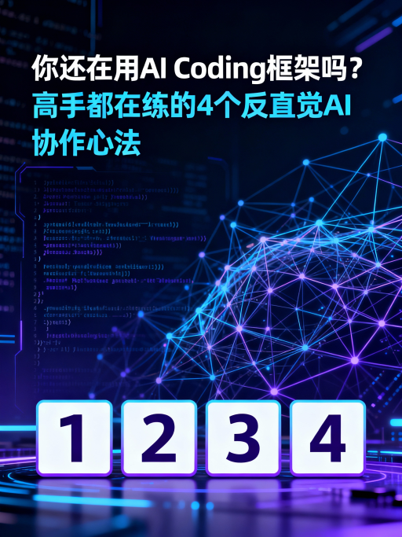

你還在用 AI Coding 框架嗎？高手都在練的 4 個反直覺 AI 協作心法

<!-- more -->

1.0 簡介：當框架成為絆腳石

近年來，開發者社群對 Aider、GPT-Engineer 等 AI Coding 框架抱持著高度的興趣與期待，它們承諾能將自然語言的構想自動轉化為可運行的專案。然而，許多開發者在實際應用後，卻陷入了一個共同的困境：這些框架帶來了過於龐雜的文件、僵化的開發流程與不必要的複雜性，最終非但沒有加速開發，反而拖慢了整個專案的進度。

這不禁讓人反思：如果框架不是最佳解方，那麼真正高效、能釋放 AI 潛力的開發模式究竟是什麼？本文將深入剖析一套更靈活、更強大的方法論：極簡流 AI Coding 心法。這並非又一個框架，而是一套回歸第一性原理的協作思維，旨在幫助你成為一個更聰明的 AI 協作者，而非框架的使用者。

2.0 重點一：拋棄完美計畫的執念，擁抱「程式碼的即時回饋」

1. 框架的陷阱：比起完美文件，你更需要會說話的程式碼

傳統 AI 框架之所以常常失敗，主要源於兩個致命缺陷：第一，它們傾向於產生海量的文件，其數量甚至會超出人類可閱讀的範圍，導致開發者與專案的實際狀況產生認知斷層 (gap)；第二，它們過度強調「由上而下 (Top-down)」的完整規劃，這種模式對於需要「由下而上 (Bottom-up)」反覆探索的複雜任務，顯得力不從心。

講者分享了自身開發「Voice Bot (語音聊天機器人)」的慘痛經歷。起初，團隊嚴格遵循框架，花費整整一個月時間撰寫鉅細靡遺的規格文件 (Spec)，然而根據這些「完美」文件生成的程式碼卻一再失敗。他們嘗試把規格寫得更細，結果文件變得極度複雜，甚至連 AI 都無法完全理解。最終，團隊決定拋棄框架，直接從最小的可行元件開始，由下而上地建構。結果，原本耗時一個月都無法解決的問題，在短短一兩天內就迎刃而解。

這個案例揭示了一個核心觀點，也完美體現了一條第一性原理：唯有程式碼與部署能真正創造價值。文件充滿了人的主觀詮釋，而一行可執行的程式碼，能立即用成功或失敗告訴你真相。它是推動專案前進最可靠、最紮實的媒介。

有的時候你不可能在動手前可以想清楚所有事情，而就算有，它可能複雜到...連 AI 都沒辦法理解。

3.0 重點二：你不是在詠唱咒語，而是在領導一位虛擬開發者

2. 重新認識你的夥伴：從「提示工具」到「自主 Agent」的思維轉變

許多開發者將 AI Coding 視為進階版的 ChatGPT，認為只要提供完美的提示 (Prompt)，就能得到完美的程式碼。然而，這是一個根本性的誤解。AI Coding 的本質，是與一個「Coding Agent (程式碼代理人)」進行協作，而不是對一個聊天機器人下指令。

這個 AI Agent 具備三大核心特徵，使其遠比單純的聊天機器人強大：

1. 高度自主性： Agent 能主動規劃、將複雜任務分解成更小的步驟來執行。
2. 使用工具： Agent 能夠讀寫檔案、下達終端機指令，就像一位真實的開發者。
3. 擁有 ReAct 反饋循環： 它會思考 (Think) 一個目標，行動 (Act) 下達指令或修改檔案，觀察 (Observe) 終端機的回饋（例如一個錯誤訊息），再根據觀察結果進行下一次的思考。這正是人類開發者解決問題的迭代循環，如今被自動化了。

理解這一點後，開發者的角色也隨之轉變。你不再是一個絞盡腦汁設計提示的「提示工程師」，而是一位懂得「同步共識、給予方向」的領導者。正如講者所強調的「先同步，再領導」，這是一種領導力的展現。

一個非常實用的協作技巧是：在給予任務指令後，附上一句「你有什麼不懂，請詢問我」。這句話會啟動一個強大的同步流程：Agent 會開始反問，透過多輪對話來釐清目標。開發者持續回答，直到 Agent 的問題變得越來越細瑣，這便是一個明確的信號——共識已經達成。

4.0 重點三：AI 放大了能力，而非取代；差距正在以驚人速度拉開

3. 可怕的放大器：AI Coding 如何拉開頂尖與新進開發者的差距

一個常見的迷思是 AI 將取代開發者，但更準確的觀點是：AI Coding 是「個人能力的放大器」。它無法無中生有，而是將你已具備的能力進行指數級的放大。

講者提出了一個精闢的公式來解釋這個現象： 開發能力 = (理解決策與規劃能力) x (與 AI 的協作能力) x (AI 本身的能力)

請注意，這是一個乘法關係，而非加法。這意味著任何一項能力的匱乏（尤其是協作能力），都可能讓最頂尖的規劃能力變得毫無價值，導致最終產出趨近於零。

資深工程師的核心價值在於公式的第一項——對需求的理解、架構的決策與任務的規劃能力，這正是 AI 目前無法取代的部分。當他們將這種頂層的規劃能力與高效的 AI 協作能力結合時，便能以前所未有的速度將腦中的想法轉化為高品質的程式碼。這種驚人的速度差異，正在從根本上改變我們對專案估時、團隊組成，甚至是「生產力」的定義。

對於這個資深的開發者來說，他的心到哪裡，他的程式碼就到哪裡，這是非常可怕的一件事情。

然而，這也為新進開發者帶來了「逆襲」的機會。他們可以從兩條路徑突圍：

1. 專注提升與 AI 的協作能力： 成為比不習慣使用 AI 的資深前輩更高效的協作者。
2. 利用 AI 作為學習加速器： 透過與 AI 的對話和實作，更快地掌握資深開發者應有的規劃與決策能力。

5.0 重點四：讓 AI 自我糾錯，用測試驅動開發（TDD）打造堅固的自動化反饋

4. 最強大的自主技能：讓測試成為 AI Agent 的眼睛和嚮導

要將 AI Agent 的潛力發揮到極致，關鍵在於提升其自主性。而最有效的方法，就是為它建立一套清晰、即時的「自動化反饋」機制。在此，一個早已存在但如今被賦予新生命的軟體工程方法論——測試驅動開發 (Test-Driven Development, TDD)——展現了無與倫比的價值。

TDD 的核心是一個簡單而強大的循環——「紅燈 -> 綠燈 -> 重構」：

1. 紅燈 (Red)： 在編寫任何功能程式碼之前，先為這個「尚未實現」的功能編寫一個必定會失敗的單元測試。此時，測試結果為紅燈。
2. 綠燈 (Green)： 將失敗的測試與需求一同交給 AI Agent。AI 會接收測試失敗時返回的具體錯誤訊息——這不是來自人類的主觀指令，而是一個客觀、可機讀的訊號，精準地告訴 Agent 問題出在哪裡。它會根據這個回饋自主修改、除錯，直到測試燈號轉為綠燈。
3. 重構 (Refactor)： 在測試保持通過（綠燈）的前提下，再讓 AI Agent 優化程式碼的結構，使其更簡潔、更易於維護，同時確保功能依然正確。

採納此方法能提供兩大決定性優勢：它不僅能確保最終產出的程式碼穩固可靠，更重要的是，它為 AI Agent 提供了一個客觀、自動化的反饋迴圈。這套方法論完美呼應了另一條第一性原理：專案中可被驗證的部份越多，專案就越健康。TDD 將驗證過程自動化，為 AI Agent 提供了最高品質的自主導航系統。

6.0 結論：最好的方法，是能應變的方法

高效的 AI 協作，並非依賴某個特定的殺手級框架，而是源於一套以「第一性原理」為基礎的靈活心法。其核心在於：拋棄繁雜的文件與僵化的流程，將可執行的程式碼視為最真實的回饋；將 AI 從一個提示工具，提升為一個需要同步與領導的自主 Agent；並善用自動化測試，為 AI 打造一個能自我修正的閉環系統。

歸根究柢，這一切都圍繞著「上下文工程 (Context Engineering)」：刻意地在 AI 有限的記憶視窗中，策劃並提供高品質、高相關性的資訊，以最大化其表現。當 AI 工具不斷迭代，我們該問的或許不是「下一個好用的框架是什麼？」，而是「如何成為一個更優秀的 AI 協作者？」。
