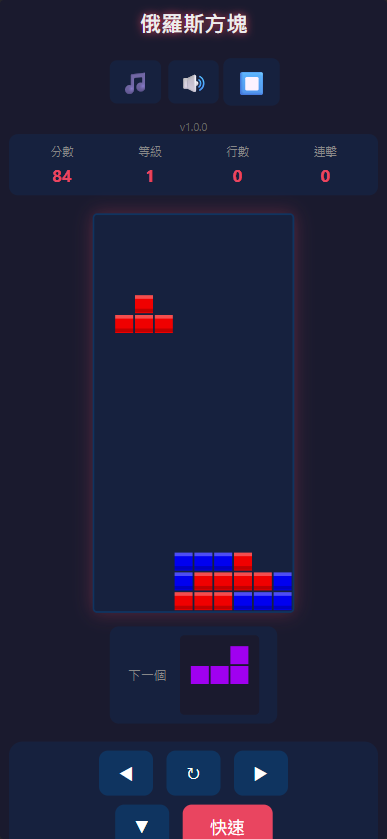

## 俄羅斯方塊 (Tetris) 🎮

**✅ 經典俄羅斯方塊網頁版，支援電腦與手機遊玩。**

俄羅斯方塊是一款風靡全球的經典方塊消除遊戲。玩家需要透過靈活移動、精準旋轉各種隨機落下的方塊，將它們拼湊成完整的橫線。每消除一行都能獲得分數並釋放空間，挑戰你的手速與空間邏輯！

<!-- more -->

# 🌟 功能特性
- 🕹️ **經典再現**：完美的俄羅斯方塊核心玩法，支援 7 種標準 SRS 形狀。
- 🔝 **等級系統**：每消除 10 行即自動升級，隨等級提升方塊下落速度，挑戰難度曲線。
- 📱 **全平台支援**：完美支援電腦鍵盤與手機觸控操作（滑動 + 虛擬按鈕）。
- 🎵 **沈浸式體驗**：高品質 Web Audio API 音效與背景音樂，支援獨立開關。
- 🤖 **智慧 AI**：內建電腦代玩模式，觀察 AI 是如何挑戰高分的。
- 🎨 **響應式佈局**：RWD 設計，在各種螢幕尺寸下皆能展現最佳視覺效果。

# 🕹️ 立即遊玩
[🔗 點此進入遊戲：Tetris Online](https://tetris.liawchiisen.workers.dev/)

# 🛠️ 技術說明
- **Rendering**: HTML5 Canvas (基於高速渲染的畫布技術)
- **Audio**: Web Audio API (提供無延遲的動態音效回饋)
- **Deployment**: Cloudflare Workers (高效、快速的全球 CDN 佈局服務)
- **Design**: Mobile First (優先考慮觸控體驗與彈性佈局)

# 📂 項目結構
- `game.js`: 核心遊戲邏輯與 AI 算法。
- `style.css`: 霓紅視覺風格與響應式樣式。
- `index.html`: 遊戲主進入點。

# 🏗️ 專案宗旨
`Tetris` 網頁版旨在展示如何利用純原生技術（Vanilla JS/CSS）在瀏覽器中實現流暢的遊戲體驗。透過精心調教的速度曲線與碰撞偵測，讓這款經典遊戲在任何裝置上都能煥發新生。

### 我的 Github 專案

[🔗 我的 Github 專案: Tetris](https://github.com/chiisen/Tetris)  
✅ 支援電腦與手機遊玩。歡迎 Star 🌟 或是 Fork 出去打造你的自定義版本！

---
