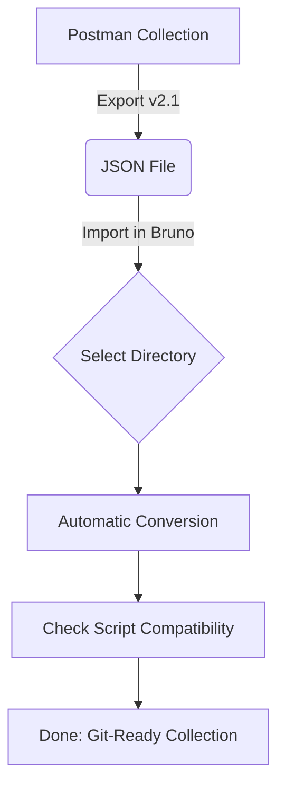

## Bruno

**🚀 Bruno - 現代化開源 API 協作工具方案**

打破雲端綁架，回歸 Git 驅動的 API 開發體驗。

<!-- more -->

# 📖 1. 什麼是 Bruno？

[Bruno](https://www.usebruno.com/) 是一個開源且強大的新型 API 客戶端工具 (API Client)，被廣泛視為 Postman 與 Insomnia 的最佳現代開源替代方案。

### 核心哲學

與其強迫將資料儲存在雲端，Bruno 選擇將 API 請求儲存為 **純文字檔案**（如 `.bru` 或 `.yml`）。這讓 API 的演進能與原始碼同步，實現真正的 **API-as-Code**。

# 🛠️ 2. 安裝指南 (macOS)

### 方式 A：Homebrew 指令 (推薦)

```bash
brew install bruno
```

### 方式 B：官網下載

直接前往 [UseBruno.com](https://www.usebruno.com/downloads) 下載對應版本的安裝檔。

# 🔄 3. 從 Postman 無痛轉移

> 📦 **預覽須知**：本圖使用 Mermaid 語法繪製。若在 VS Code 中看不到圖示，
> 請安裝擴充套件 [Markdown Preview Mermaid Support](https://marketplace.visualstudio.com/items?itemName=bierner.markdown-mermaid)
> （搜尋 `bierner.markdown-mermaid`）後，重新開啟 Markdown Preview 即可正常顯示。



### 3.1 轉移後的工程化目錄結構

匯入後，您的 API 專案會從單一 JSON 轉化為清晰的實體目錄：

```text
API-Project-Name/
├── bruno.json          # 集合宣告檔 (Root)
├── environments/       # 環境變數定義
│   └── Local.yml       # Local 環境設定
├── Auth/               # API 分群資料夾
│   ├── Login.bru       # 獨立的 API 請求檔
│   └── Logout.bru
└── Users/
    └── Profile.bru
```

### 3.2 腳本語法對照表 (Troubleshooting)

如果您原本在 Postman 有撰寫測試腳本，請依下表進行微調：

| 功能               | Postman (Legacy)               | Bruno (Modern)               |
| :----------------- | :----------------------------- | :--------------------------- |
| 讀取環境變數       | `pm.environment.get("id")`     | `bru.getEnvVar("id")`        |
| 寫入環境變數       | `pm.environment.set("id", 1)`  | `bru.setEnvVar("id", 1)`     |
| 獲取 Response Body | `pm.response.json()`           | `res.getBody()`              |
| 獲取 Header        | `pm.response.headers.get("X")` | `res.getHeader("X")`         |
| 發送非同步請求     | `pm.sendRequest(...)`          | `await bru.sendRequest(...)` |

# 🤖 4. 自動化測試與 CLI

### CLI 安裝

```bash
npm install -g @usebruno/cli
```

### 常用測試指令

> [!IMPORTANT]
> 執行 `bru run` 時，路徑必須位於包含 `bruno.json` 的 **根目錄**。

- **執行單一測試**：
  ```bash
  bru run Auth/Login.bru --env Local
  ```
- **執行全項目並產出 JUnit 報告 (CI/CD 友善)**：
  ```bash
  bru run --env Local --output results.xml --format junit
  ```
- **開啟除錯模式**：
  ```bash
  bru run Auth/Login.bru --env Local --verbose
  ```

# 💡 總結

Bruno 不僅是一個工具，更是一種對 **開發者主權** 的回歸。它讓 API 測試資料不再是孤島，而是與專案代碼並肩作戰的資產。對於重視資安、效能與版控準確性的 Laravel 或現代化 Web 專案，Bruno 是絕對的首選。

### 我的 Github 專案

[🔗 我的 Github 專案: Bruno](https://github.com/chiisen/Bruno)  
✅現代化開源 API 協作工具方案，打破雲端綁架，歡迎 Star 🌟！

---
