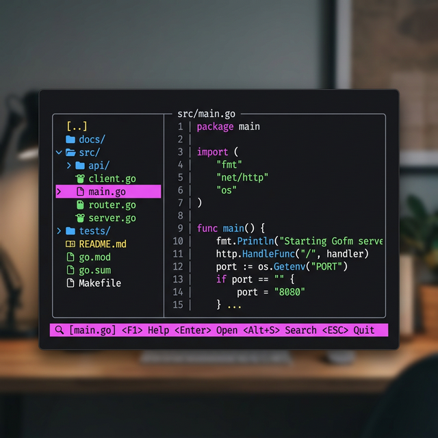
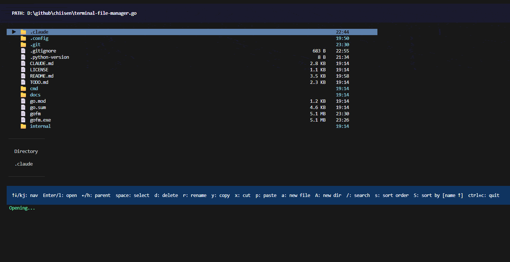

## Terminal File Manager (gofm) 📂

**✅ 基於 Go 語言開發的高效能、直覺且具備現代化 TUI 的終端機檔案管理器。**

gofm (Go File Manager) 是一款基於 Bubble Tea 框架開發的高效能終端機檔案管理工具。它結合了傳統 ls/cd 的極速與圖形介面的視覺便利性，專為開發者打造一個流暢的檔案管理體驗。

<!-- more -->

# 🌟 核心特性
- 🚀 **極速導航**：比傳統 GUI 檔案總管更輕量，操作反應靈敏，比 ls/cd 更具直覺。
- 🔍 **Fuzzy 搜尋**：按 `/` 鍵即可啟動模糊搜尋，即時從海量檔案中篩選出目標。
- 📦 **大型目錄支援**：採用非同步載入技術與 Lazy Loading，即使是包含 10k+ 檔案的目錄也能流暢滾動。
- 🛠️ **豐富預覽**：選取檔案時自動顯示預覽面板，支援文字檔案高亮、圖片檔案資訊及二進制檔案摘要。
- 🌳 **Git 整合**：即時顯示倉庫內的 Git 狀態 (M: 修改, A: 新增, D: 刪除)，無須切換工具即可掌握專案動態。
- 🔌 **擴充性與外掛**：支援自定義外掛系統，讓使用者能透過配置強化管理器的各種功能。

# 🛠️ 技術棧
- **Language**: Go 1.21+
- **Framework**: [Bubble Tea](https://github.com/charmbracelet/bubbletea) (TUI 核心)
- **Styling**: [Lip Gloss](https://github.com/charmbracelet/lipgloss) (介面美學)
- **SSH/SFTP**: 支援遠端檔案系統掛載與管理
- **Concurrency**: 使用 Go Goroutines 實作高效的非同步 IO 與 Git 狀態檢索

# 🏗️ 專案宗旨
`terminal-file-manager.go` 的目標在於極大化提高終端機的操作效率。在開發過程中，頻繁的目錄切換與檔案預覽往往佔據大量時間。gofm 致力於將這些日常瑣事簡化為一次按鍵，並透過優秀的介面美學設計讓終端機工作環境更加愉悅。

### 我的 Github 專案

[🔗 我的 Github 專案: terminal-file-manager.go](https://github.com/chiisen/terminal-file-manager.go)  
✅ 一個高效能、現代化的 Go 終端機檔案管理器。歡迎 Star 🌟 收藏或是參與貢獻！

---
