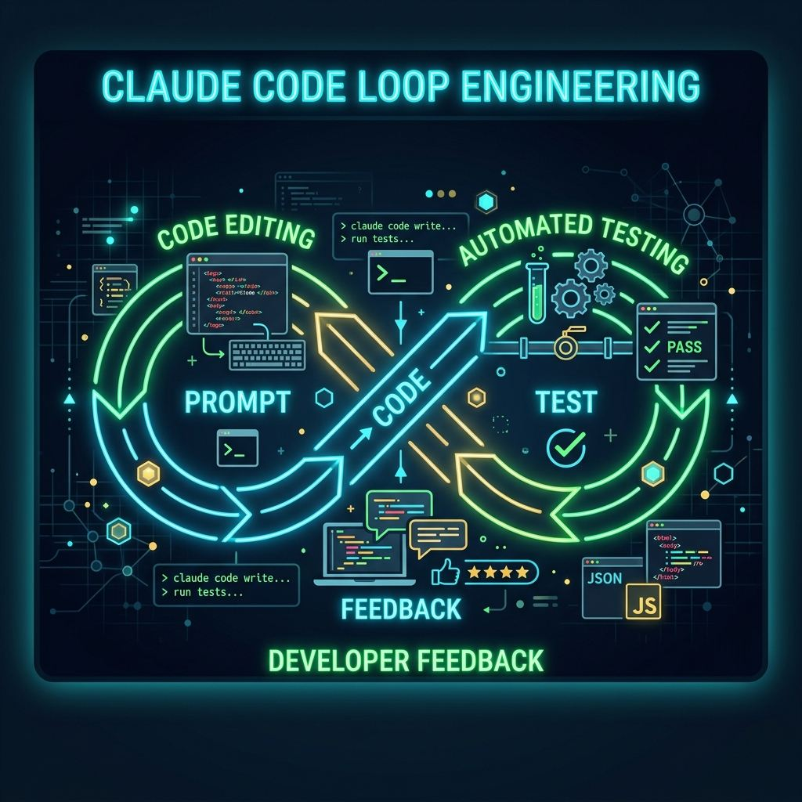
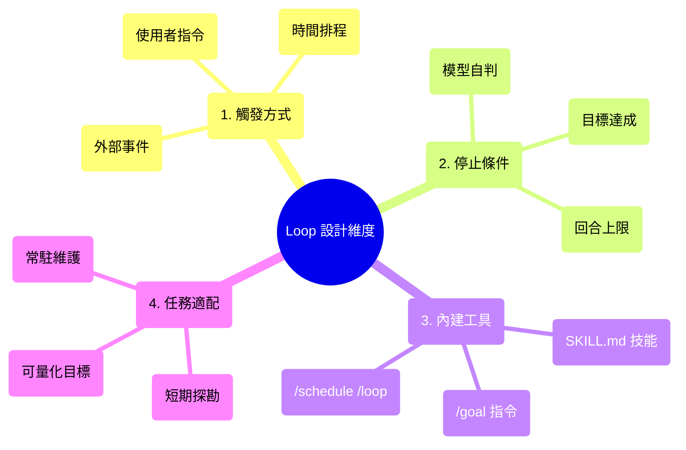
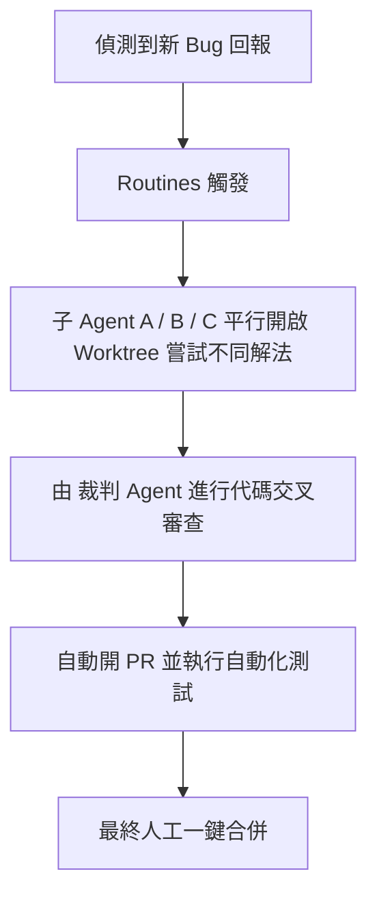

## 🔄 Claude Code 官方拆解「迴圈」設計

**✅ 本文拆解 Anthropic 官方發布的 AI Agent「迴圈（Loop）工程」方法論，解析回合制、目標式、時間式與主動式四種迴圈的運作機制與實戰應用。**



<!-- more -->

最近在 X（原 Twitter）上，開發社群開始瘋傳「設計迴圈（Loop）」這套說法。許多人認為，如果你不懂得幫 Agent 設計合適的 Loop，就無法真正發揮 Claude Code 的進階實力。

然而，當你深入搜尋「迴圈」時，往往會發現十個人有十種說法。為了解除這個混亂，Claude Code 團隊（Delba de Oliveira 與 Michael Segner）親自在官方部落格發布了《Loop engineering: Getting started with loops》方法論，為這套新型態的 AI 開發思維定調。

本篇文章將以結構化的視角，帶你快速掌握「迴圈工程（Loop Engineering）」核心概念、四種設計模式，以及在實務開發中如何防範 Token 暴漲的自我防禦機制。

---

# 🌟 什麼是「迴圈工程」？

官方對 AI 迴圈（Agentic Loop）的定義非常直白：
> **「迴圈，就是代理（Agent）重複執行『收集上下文、採取行動、驗證工作』的循環，直到滿足特定的停止條件為止。」**

很多人以為「迴圈」就是讓 AI 重複做同一件事，例如在 Prompt 裡寫：「請幫我一直修改這個 Bug，直到你滿意為止。」

但這樣設計出來的往往只是一個「不斷跳出確認視窗問你是否要繼續」的手動流程，而不是真正省力的自動化。要將手動改成真正的自動化迴圈，必須在設計前釐清以下四個維度：



---

# 🏗️ 四種迴圈模式與指令對照

不同任務需要的「人眼盯場」程度不一樣。官方將其拆解為四種基本迴圈，並給予對應的實務工具：

| 迴圈類型 | 觸發方式 | 停止條件 | 內建工具/指令 | 適合場景 |
| :--- | :--- | :--- | :--- | :--- |
| **1. 回合制迴圈** | 使用者輸入 Prompt | 模型自判或需要人工補充 | `SKILL.md` (自訂技能) | 短期、探索性的任務 |
| **2. 目標式迴圈** | 使用者 Prompt 與上限 | 目標達成或觸發上限 | `/goal` (v2.1.139+) | 有明確、可驗證目標的任務 |
| **3. 時間式迴圈** | 固定時間間隔 | 手動停止或 7天自動到期 | `/loop` 或 `/schedule` | 例行重覆或需要與外部系統互動 |
| **4. 主動式迴圈** | 外部事件 / webhook | 各任務獨立目標結束 | `auto mode` + `dynamic workflows` | 長時間執行、全自動的 CI/CD 整合 |

---

# 🛠️ 迴圈模式深入剖析

### 1. 回合制迴圈 (Turn-based loops) — 善用 `SKILL.md` 做自我驗證

這是最基礎的模式。每當你對 Claude 下達指令，它就會啟動一個回合制迴圈。

為了避免 Agent「憑感覺」回報工作已完成，升級的作法是編寫一份 `.claude/skills/verify-frontend-change/SKILL.md` 檔，作為 Agent 驗收標準：

```markdown
---
name: verify-frontend-change
description: 在宣告 UI 改動完成之前，必須進行端到端驗證。
---
# 驗證前端改動驗收標準

1. 啟動開發伺服器，並於瀏覽器中打開被修改的頁面。
2. 檢查主控台是否有任何 Error 或 Warning。
3. 使用 Chrome Devtools MCP 跑效能追蹤，核心指標（Core Web Vitals）不能衰退。
```
有了這套規則，Claude 就能在回合結束前自主完成驗收，降低人工確認的來回次數。

---

### 2. 目標式迴圈 (Goal-oriented loops) — `/goal` 自動評估機制

對於無法一回合搞定的複雜任務（例如代碼重構、優化 Lighthouse 分數），應使用 `/goal` 指令：

```bash
/goal 把首頁的 Lighthouse 效能分數提升到 90 分以上；如果 5 回合後仍未達成則停止並說明原因。
```

在目標式迴圈中，會引入一個 **評估模型（Evaluator Model）**。每當主模型想要收工時，評估模型就會跳出來檢查條件是否達成。如果沒達標，就會直接被打回票、退回重寫，直到目標達成或達到設定的回合上限。

> ⚠️ **注意**：評估模型只根據**對話中呈現的證據**來判斷，它不會自己去讀檔案或跑測試。因此，你的 Agent 必須把測試輸出或效能報告明確打印在對話中。

---

### 3. 時間式迴圈 (Time-based loops) — `/loop` 與 `/schedule`

當你需要定期執行任務，比如每隔一段時間爬取外部資訊或監測 CI 狀態時，可使用時間式迴圈：

* **本地執行 `/loop`**：
  ```bash
  /loop 5m 檢查我的 PR 狀態，有審查意見或 CI 失敗就自動處理。
  ```
  *限制：必須保持目前終端 Session 啟用，電腦關機或終端關閉即失效，且任務最長 7 天自動到期。*
* **雲端常駐 `/schedule`**（研發預覽階段）：
  這會將任務託管至 Anthropic 的雲端基礎設施，即便關閉本地電腦仍會持續運行，但目前排程最小間隔為 1 小時。

---

### 4. 主動式迴圈 (Proactive loops) — 多代理協作

這是最複雜的自動化境界。結合 `auto mode` 與 `dynamic workflows` (v2.1.154+)，讓多個子 Agent 進行分工與對照審查：



---

# 🚀 實戰心法：如何設計高效率的迴圈？

迴圈跑出來的效果好壞，取決於你圍繞著它所建立的**工程配套系統**：

* 🚀 **保持既有代碼乾淨**：AI 寫代碼是「模仿遊戲」，專案代碼越亂，它學到的壞習慣就越多。
* 🚀 **明確界定收斂條件**：如果連你都講不清楚驗收標準，硬套 `/goal` 只會讓 AI 瞎繞、白白燒錢。
* 🚀 **重複工作交給腳本**：有些確定性的步驟（例如轉換 PDF、格式化），請寫成 Bash 或 Python 腳本讓 Agent 直接執行，不要每次都讓 AI 重新推理，這能省下大量 Token。
* 🚀 **即時監控預算**：善用 `/usage`（查看本回合 Token）與 `/workflows` 指令（查看子 Agent 的 Token 消耗），發現異常時大膽按下中斷。

---

# 📂 參考資料

- Anthropic 官方部落格: *Loop engineering: Getting started with loops*
- Claude Code 官方文件: *Loops and goal setting (/goal)*
- Claude Code 官方文件: *Scheduled tasks and /loop*

---
*本文採用 Creative Commons 姓名標示-非商業性-禁止改作 (CC BY-NC-ND) 授權轉載。*
